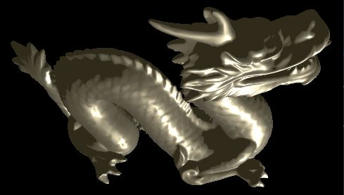
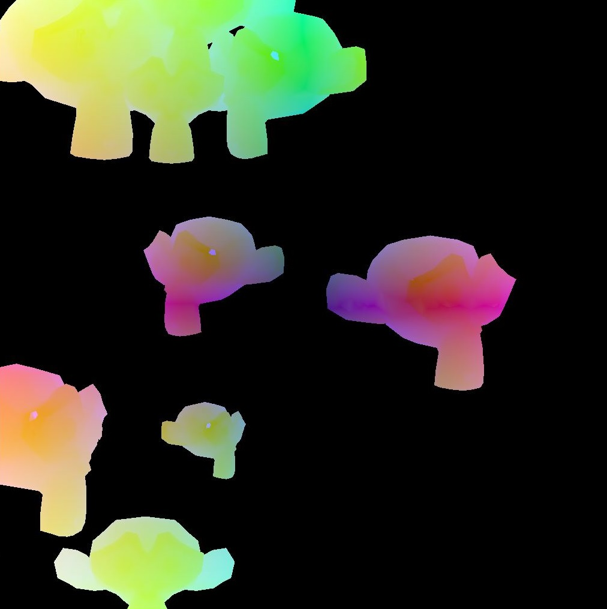

# tokei
An experimental render engine based on Vulkan.

## features

1. simple GPU - GPU synchronization
2. implicit image layout transitions
3. handles memory allocation through [VMA](https://github.com/GPUOpen-LibrariesAndSDKs/VulkanMemoryAllocator)
4. descriptor set and pipeline layouts are read from the shaders using [SPIRV-Cross](https://github.com/KhronosGroup/SPIRV-Cross) reflection features
5. buffers and textures are bound to set and binding slots; no explicit descriptor set management is required

## examples

### [basic](https://github.com/sagering/tokei/tree/main/examples/basic)

Renders two moving, color changing triangles showcasing swapchain creation, basic pipeline setup, vertex buffer transfer, uniform buffer and texture usage.

### [suzanne](https://github.com/sagering/tokei/tree/main/examples/suzanne)

Demonstrates a possible workflow of uploading meshes to the device.

### [pbr](https://github.com/sagering/tokei/tree/main/examples/pbr)

Renders a complex mesh using a physical based rendering technique (pbr) called BRDF. This example demonstrates how to setup a depth buffer.

### [headless_compute](https://github.com/sagering/tokei/tree/main/examples/headless_compute)

Performs particle movement calculations in a compute shader and reads back the results to host memory. No window, surface and swapchain is required (headless).

### [multiple_objects](https://github.com/sagering/tokei/tree/main/examples/multiple_objects)

Showcases the use of dynamic uniform buffer offsets to effeciently set uniform data on multiple objects using a single buffer.

## build

This library has only been tested on Windows 10 so far. It is not expected to work on other platforms yet, due to platform specific surface creation code. Use Cmake to generate a visual studio project.

## todos

1. proper handling of CPU - GPU synchronization
2. multithreading support
3. multi queue support
4. and more
