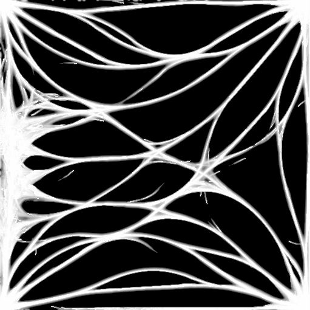

# tokei

A user friendly abstraction layer on top of Vulkan.

## features

1. Exposes "virtual" graphics, transfer and compute queue. 
2. Simplified buffer and texture creation.
3. No explicit descriptor set management is required.
4. Shader reflection for automatic pipeline layout extraction using [SPIRV-Cross](https://github.com/KhronosGroup/SPIRV-Cross).
5. Simplified pipeline setup.
6. Simplified memory management backed by [VMA](https://github.com/GPUOpen-LibrariesAndSDKs/VulkanMemoryAllocator).

## examples

### [basic](https://github.com/sagering/tokei/tree/main/examples/basic)

Renders two moving, color changing triangles showcasing swapchain creation, basic pipeline setup, vertex buffer transfer, uniform buffer and texture usage.

### [suzanne](https://github.com/sagering/tokei/tree/main/examples/suzanne)

Demonstrates a possible workflow of uploading meshes to the device.

### [pbr](https://github.com/sagering/tokei/tree/main/examples/pbr)

Renders a complex mesh using a physical based rendering technique (pbr) called BRDF. This example demonstrates how to setup a depth buffer.

### [headless_compute](https://github.com/sagering/tokei/tree/main/examples/headless_compute)

Performs particle movement calculations in a compute shader and reads back the results to host memory. No window, surface and swapchain is required (headless).

### [multiple_objects](https://github.com/sagering/tokei/tree/main/examples/multiple_objects)

Showcases the use of dynamic uniform buffer offsets to effeciently set uniform data on multiple objects using a single buffer.

### [slime](https://github.com/sagering/tokei/tree/main/examples/slime)

Slime simulation using compute shader, storage images and buffers inspired by [Sebastion Lagues Slime-Simulation](https://github.com/SebLague/Slime-Simulation).

## build

This library has only been tested on Windows 10 so far. It is not expected to work on other platforms yet, due to platform specific surface creation code. Use Cmake to generate a visual studio project.

## todos

Multi thread support and more.
