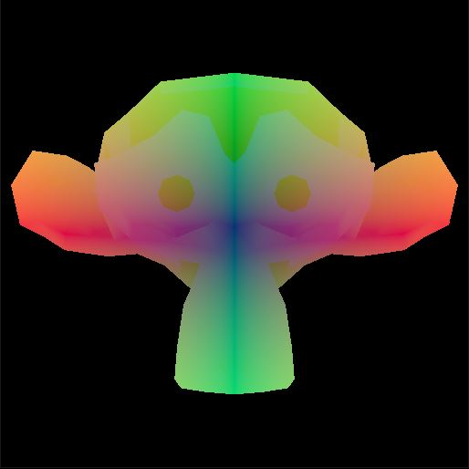

# tokei
An experimental render engine based on Vulkan.

## build

This library has only been tested on Windows 10 so far. It is not expected to work on other platforms yet, due to platform specific surface creation code. Use Cmake to generate a visual studio project.

## features

1. automatic GPU - GPU synchronization
2. automatic image transitions
3. handles memory allocation through [VMA](https://github.com/GPUOpen-LibrariesAndSDKs/VulkanMemoryAllocator)
4. descriptor set and pipeline layouts are read from the shaders using [SPIRV-Cross](https://github.com/KhronosGroup/SPIRV-Cross) reflection features
5. buffers and textures are bound to set and binding slots; no explicit descriptor set management is required

## todos

1. proper handling of CPU - GPU synchronization
2. multithreading support
3. multi queue support
4. and more
